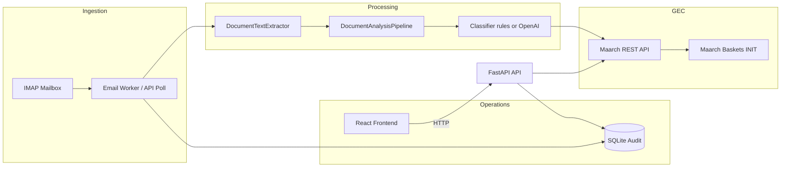
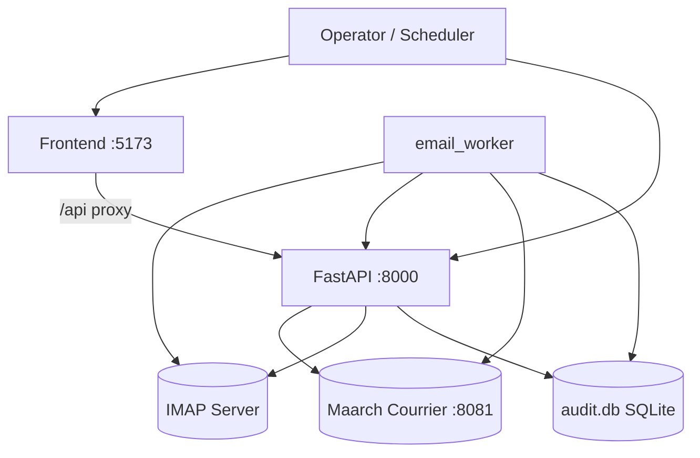
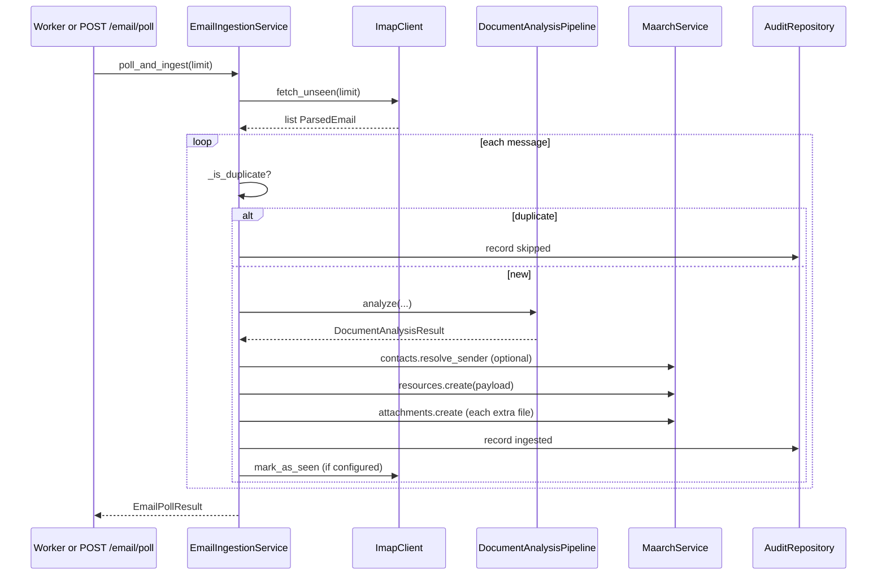
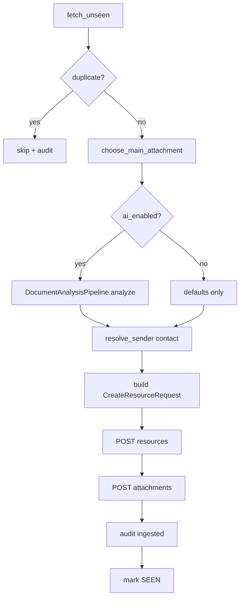
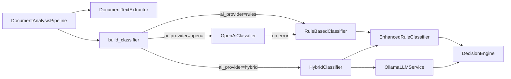
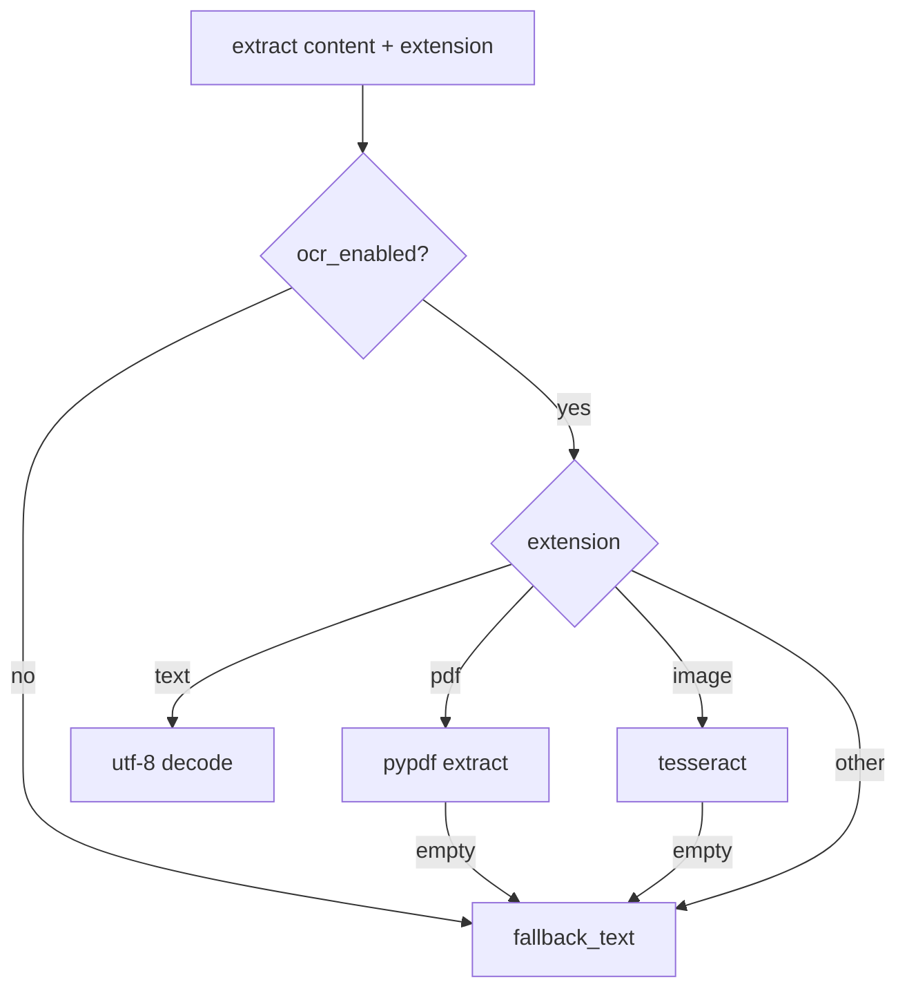
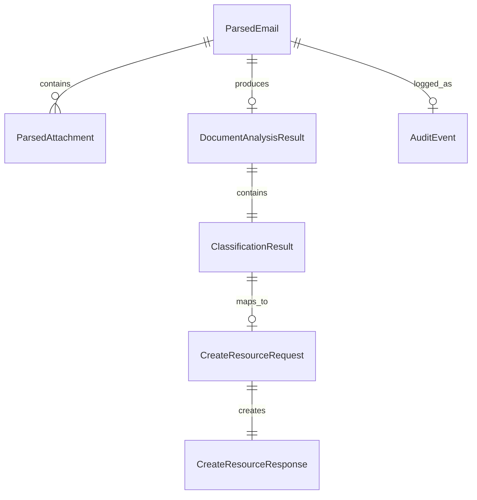
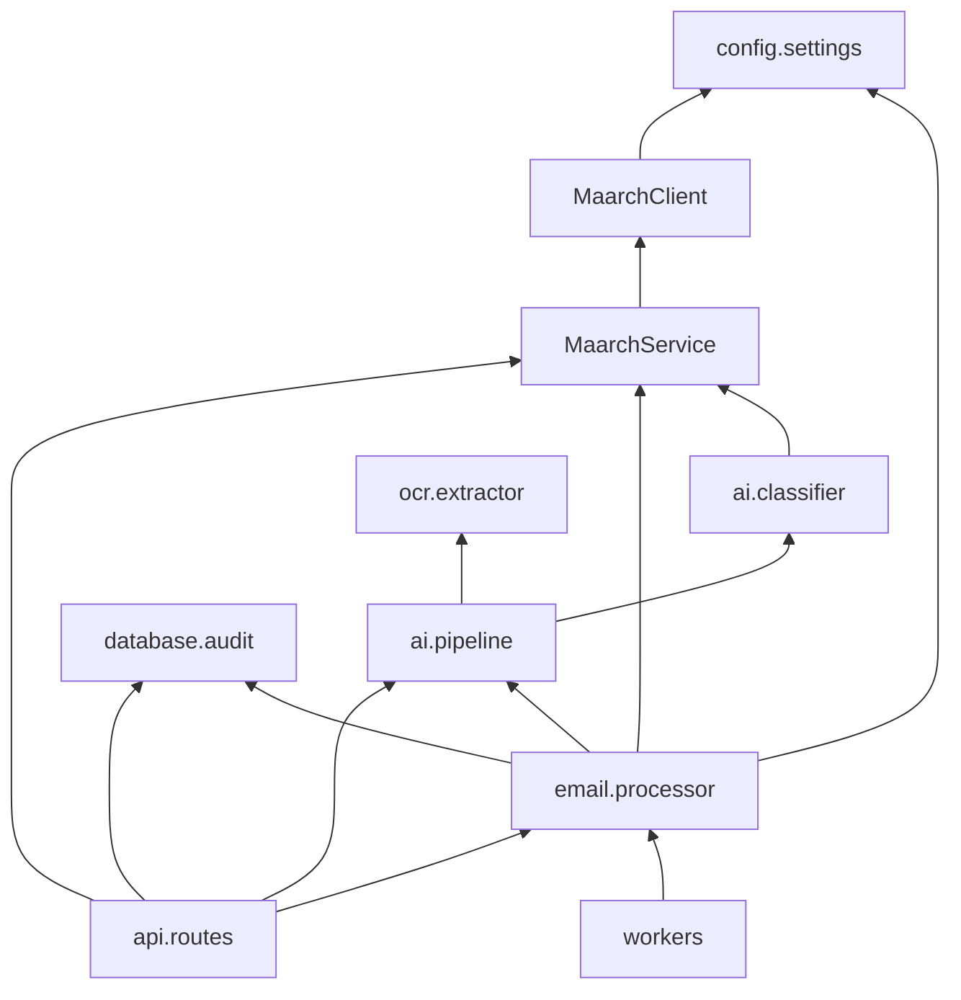
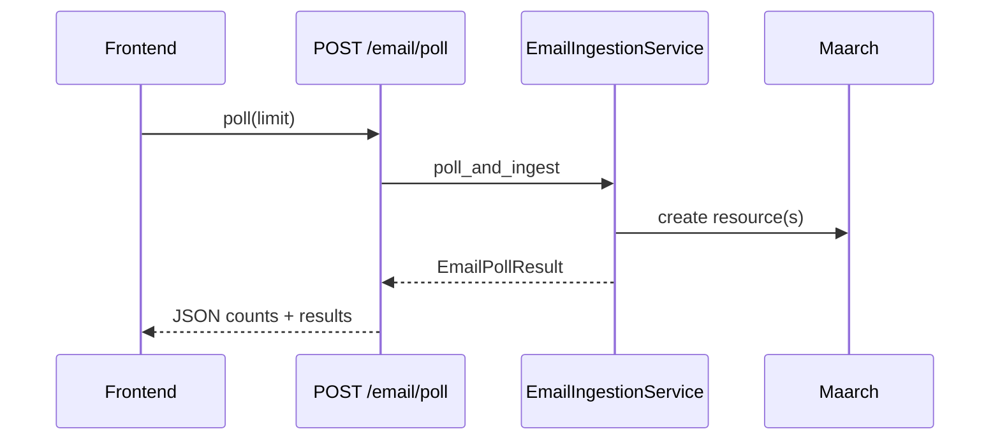
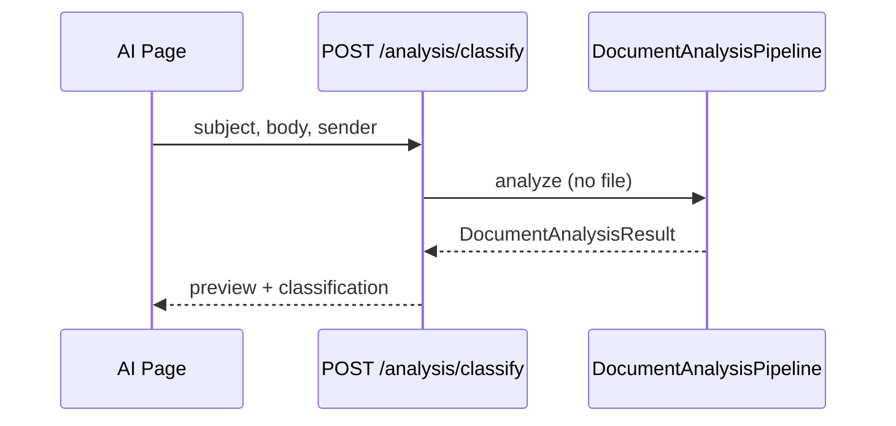

# Intelligent Mailroom — Architecture Documentation

This document describes the **Intelligent Mailroom** platform: an external automation service that ingests incoming email, extracts and classifies document content, and injects structured courriers into **Maarch Courrier** (GEC) via its REST API. It is intended as a technical handbook for developers onboarding without access to the original authors.

**Repository layout (high level):**

| Area                  | Path                               | Role                        |
| --------------------- | ---------------------------------- | --------------------------- |
| Backend API & workers | `src/`                             | Python 3.10+ business logic |
| HTTP entry            | `main.py`                          | Uvicorn ASGI entry          |
| Operations UI         | `frontend/`                        | React SPA (consumer only)   |
| Tests                 | `tests/`                           | Pytest suite                |
| Deployment            | `Dockerfile`, `docker-compose.yml` | API + worker + frontend     |

---

## 1. Project Overview

### Purpose

Automate **incoming mail qualification** before human workflow in Maarch Courrier:

1. Poll an IMAP mailbox for unread messages.
2. Extract text from email body and attachments (PDF/OCR).
3. Classify and route (destination entity, document type, subject).
4. Create a Maarch **resource** (courrier) in status `INIT` (Qualification basket).
5. Attach remaining files and record an audit trail.

The service **does not modify Maarch core**; it is a separate FastAPI application that calls Maarch’s documented REST endpoints.

### Problem it solves

Manual mailroom operators must open each email, read attachments, decide the correct **entity** and **doctype**, and index in Maarch. This project reduces that to an automated first pass with optional human validation in Maarch baskets.

### High-level workflow



### Main technologies

| Layer                | Technology                                                                                                                                    |
| -------------------- | --------------------------------------------------------------------------------------------------------------------------------------------- |
| API                  | FastAPI, Uvicorn, Starlette                                                                                                                   |
| Config               | Pydantic Settings, `.env`                                                                                                                     |
| HTTP client (Maarch) | `requests` + session, Basic Auth                                                                                                              |
| Email                | stdlib `imaplib`, `email`                                                                                                                     |
| OCR / PDF            | `pypdf`; optional `pytesseract` + Pillow                                                                                                      |
| AI (optional)        | Hybrid: multilingual rule engine (FR/EN/AR) + local Qwen 2.5 7B via Ollama + decision engine; optional OpenAI-compatible Chat Completions API |
| Persistence (audit)  | SQLite via stdlib                                                                                                                             |
| Frontend             | React 19, Vite, TanStack Query, i18next                                                                                                       |
| Containers           | Docker Compose (api, worker, frontend)                                                                                                        |

### Architecture style

**Layered, service-oriented integration** with clear boundaries:

- **API layer** (`src/api/`) — HTTP, validation, no business rules.
- **Application services** (`EmailIngestionService`, `DocumentAnalysisPipeline`, `MaarchService`) — orchestration.
- **Domain adapters** (`maarch/`, `email/`, `ocr/`, `ai/`) — external systems and algorithms.
- **Infrastructure** (`config/`, `database/`, `utils/`) — cross-cutting concerns.

Composition and **constructor injection** (optional dependencies with defaults) dominate over inheritance. **Facade** pattern: `MaarchService` groups Maarch sub-services.

---

## 2. High-Level Architecture



| Component    | Explanation                                                                                                               |
| ------------ | ------------------------------------------------------------------------------------------------------------------------- |
| **Frontend** | Read-only/control UI: health, poll mailbox, view audit, Maarch metadata, AI playground. No duplicate backend logic.       |
| **FastAPI**  | REST `/api/v1/*` for health, email poll, analysis, Maarch proxy, audit events.                                            |
| **Worker**   | Long-running loop: `EmailIngestionService.poll_and_ingest()` on an interval. Shares same code path as `POST /email/poll`. |
| **IMAP**     | Source of raw MIME messages and attachments.                                                                              |
| **Maarch**   | System of record for courriers, contacts, reference data.                                                                 |
| **Audit DB** | Idempotency (`message_id`), operations trace, dashboard data for UI.                                                      |

**Design decision:** Worker and API both instantiate `EmailIngestionService` independently (no shared in-memory queue). Scaling ingestion = multiple workers with careful IMAP locking (not implemented; single worker assumed).

---

## 3. Directory Structure

```
intelligent-mailroom/
├── main.py                 # Uvicorn entry: create_app()
├── Dockerfile              # Backend image
├── docker-compose.yml      # api + worker + frontend
├── requirements.txt
├── src/
│   ├── api/                # HTTP layer
│   ├── ai/                 # Hybrid classification pipeline (rules + Qwen via Ollama + OpenAI)
│   ├── config/             # Settings singleton
│   ├── database/           # Audit repository
│   ├── email/              # IMAP + ingestion orchestration
│   ├── maarch/             # Maarch REST client & services
│   ├── ocr/                # Text extraction
│   ├── utils/              # Logging
│   └── workers/            # Background poll loop
├── tests/
└── frontend/               # React SPA
```

### `src/api/`

| Responsibility | Routes, CORS, dependency wiring |
| Used by | Uvicorn only |
| Key modules | `app.py`, `dependencies.py`, `routes/*.py` |

### `src/ai/`

| Responsibility | Multilingual rule engine, hybrid classifier (rules + Qwen via Ollama), decision engine, analysis pipeline |
| Depends on | `config`, `ocr`, `maarch.reference` (optional), `requests` (Ollama / OpenAI) |
| Used by | `email.processor`, `api.routes.analysis` |
| Key modules | `routing.py`, `rule_engine.py`, `text_normalizer.py`, `llm_service.py`, `decision_engine.py`, `classifier.py`, `pipeline.py`, `models.py` |

### `src/config/`

| Responsibility | `Settings` from environment |
| Depends on | `pydantic-settings` |
| Used by | Entire backend |

### `src/database/`

| Responsibility | SQLite audit schema and queries |
| Used by | `EmailIngestionService`, audit API |

### `src/email/`

| Responsibility | IMAP client, MIME parsing, ingestion service |
| Depends on | `ai`, `maarch`, `database` |
| Used by | API email routes, worker |

### `src/maarch/`

| Responsibility | HTTP client, resources, attachments, reference, contacts |
| Depends on | `config`, `requests` |
| Used by | Ingestion, all Maarch API routes |

### `src/ocr/`

| Responsibility | PDF/text/image extraction → `OcrResult` |
| Depends on | `config`, optional pypdf/tesseract |
| Used by | `DocumentAnalysisPipeline` |

### `src/workers/`

| Responsibility | Infinite poll loop with sleep |
| Depends on | `EmailIngestionService` |

### `frontend/`

| Responsibility | Enterprise UI; centralized `services/api/*` |
| Depends on | Backend REST only |

---

## 4. File-by-File Documentation (Backend)

The table below covers **every production Python module** under `src/`. Test and script files are omitted.

| File                      | Purpose                           | Key public API                                                                                                | Depends on                                                   |
| ------------------------- | --------------------------------- | ------------------------------------------------------------------------------------------------------------- | ------------------------------------------------------------ |
| `main.py`                 | ASGI app export                   | `app`                                                                                                         | `create_app()`                                               |
| `api/app.py`              | Factory, CORS, router mount       | `create_app()`                                                                                                | routes, settings                                             |
| `api/dependencies.py`     | Optional Maarch service           | `get_maarch_service_optional()`                                                                               | Maarch                                                       |
| `api/routes/health.py`    | Liveness/readiness                | `/health`, `/health/live`, `/health/ready`                                                                    | Maarch, audit, settings                                      |
| `api/routes/email.py`     | IMAP status, poll                 | `/email/status`, `/health`, `/poll`                                                                           | `EmailIngestionService`                                      |
| `api/routes/analysis.py`  | AI status, classify, rules        | `/analysis/*`                                                                                                 | `DocumentAnalysisPipeline`                                   |
| `api/routes/maarch.py`    | Maarch proxy CRUD                 | `/maarch/*`                                                                                                   | `MaarchService`                                              |
| `api/routes/audit.py`     | Audit listing                     | `/audit/events`                                                                                               | `AuditRepository`                                            |
| `config/settings.py`      | Env configuration                 | `Settings`, `get_settings()`                                                                                  | pydantic-settings                                            |
| `utils/logger.py`         | Structured logging helper         | `get_logger()`                                                                                                | stdlib logging                                               |
| `database/audit.py`       | Audit persistence                 | `AuditRepository`, `get_audit_repository()`                                                                   | SQLite                                                       |
| `email/imap_client.py`    | IMAP fetch/parse                  | `ImapClient`, helpers                                                                                         | settings                                                     |
| `email/models.py`         | Email DTOs                        | `ParsedEmail`, `EmailPollResult`, …                                                                           | pydantic                                                     |
| `email/exceptions.py`     | Email errors                      | `EmailConfigurationError`, …                                                                                  | —                                                            |
| `email/processor.py`      | **Core ingestion orchestrator**   | `EmailIngestionService`                                                                                       | ai, maarch, database                                         |
| `ocr/extractor.py`        | Text extraction                   | `DocumentTextExtractor`                                                                                       | pypdf, optional OCR                                          |
| `ocr/models.py`           | `OcrResult`                       | —                                                                                                             | pydantic                                                     |
| `ai/routing.py`           | Static routing rules              | `ROUTING_RULES`, `RoutingRule`                                                                                | dataclass                                                    |
| `ai/rule_engine.py`       | Multilingual rule classifier      | `EnhancedRuleClassifier`, `RULE_DEFINITIONS`                                                                  | text_normalizer, reference                                   |
| `ai/text_normalizer.py`   | Text normalization (FR/AR/OCR)    | `normalize_text()`, `normalize_arabic()`                                                                      | stdlib (unicodedata, re)                                     |
| `ai/llm_service.py`       | Local LLM via Ollama              | `OllamaLLMService`                                                                                            | requests, config, models                                     |
| `ai/decision_engine.py`   | Rule + LLM reconciliation         | `DecisionEngine`                                                                                              | models                                                       |
| `ai/classifier.py`        | Rules, hybrid, OpenAI classifiers | `build_classifier()`, `RuleBasedClassifier`, `HybridClassifier`, `OpenAiClassifier`                           | routing, rule_engine, llm_service, decision_engine, requests |
| `ai/pipeline.py`          | OCR → classify → safe defaults    | `DocumentAnalysisPipeline`                                                                                    | ocr, ai, config                                              |
| `ai/models.py`            | Analysis DTOs                     | `ClassificationResult`, `DocumentAnalysisResult`, `RuleAnalysisResult`, `LLMAnalysisResult`, `DecisionResult` | pydantic                                                     |
| `maarch/client.py`        | HTTP + retries                    | `MaarchClient`                                                                                                | requests                                                     |
| `maarch/connection.py`    | Connection validation             | `validate_maarch_connection()`                                                                                | client                                                       |
| `maarch/resources.py`     | Courrier CRUD                     | `ResourceService`                                                                                             | client, models                                               |
| `maarch/attachments.py`   | Attachment upload                 | `AttachmentService`                                                                                           | client, models                                               |
| `maarch/reference.py`     | Entities, doctypes, models        | `ReferenceDataService`                                                                                        | client                                                       |
| `maarch/contacts.py`      | Sender → contact                  | `ContactService`                                                                                              | client                                                       |
| `maarch/models.py`        | Maarch request/response models    | Pydantic models                                                                                               | pydantic                                                     |
| `maarch/exceptions.py`    | Maarch errors                     | `MaarchAPIError`, …                                                                                           | —                                                            |
| `maarch/__init__.py`      | **Facade** `MaarchService`        | `get_maarch_service()`                                                                                        | all maarch services                                          |
| `workers/email_worker.py` | Poll loop                         | `run_polling_loop()`                                                                                          | ingestion                                                    |

**Why `email/processor.py` is central:** It is the only module that ties IMAP, analysis, Maarch creation, attachments, deduplication, and audit into one transactional narrative per message.

---

## 5. Class Documentation

### `Settings` (`config/settings.py`)

| Aspect         | Detail                                             |
| -------------- | -------------------------------------------------- |
| Responsibility | Single source of truth for environment             |
| Lifecycle      | `@lru_cache` singleton via `get_settings()`        |
| Validation     | Pydantic types; missing `maarch_url` fails at load |

### `EmailIngestionService` (`email/processor.py`)

| Aspect           | Detail                                                                                                                |
| ---------------- | --------------------------------------------------------------------------------------------------------------------- |
| Responsibility   | End-to-end email → Maarch ingestion                                                                                   |
| Constructor deps | `Settings`, `ImapClient`, `MaarchService`, `DocumentAnalysisPipeline`, `AuditRepository` (all optional with defaults) |
| Public methods   | `poll_and_ingest(limit?)`                                                                                             |
| Private flow     | `_ingest_message`, `_build_resource_payload`, `_is_duplicate`, `_record_audit_event`, `_resolve_sender_contact`       |
| Composition      | Does not subclass; composes services                                                                                  |

### `DocumentAnalysisPipeline` (`ai/pipeline.py`)

| Responsibility | Run OCR then classifier; apply confidence floor |
| Public | `analyze(subject, sender, body_text, file_content, file_extension)` |
| Private | `_apply_safe_defaults`, `_compose_fallback_text` |
| Uses | `model_copy` on `ClassificationResult` for immutable-style updates |

### `MaarchService` (`maarch/__init__.py`)

| Responsibility | Facade over `ResourceService`, `AttachmentService`, `ReferenceDataService`, `ContactService` |
| Why facade | API routes and ingestion depend on one entry point |

### `MaarchClient` (`maarch/client.py`)

| Responsibility | HTTP transport, retries, JSON parsing, Basic Auth |
| Retry policy | HTTP 408, 429, 5xx; connection/timeout/chunked errors |
| Not responsible for | Business mapping (delegated to services) |

### `AuditRepository` (`database/audit.py`)

| Responsibility | Append-only ingestion events; duplicate check on `message_id` |
| Schema | `ingestion_events` table (see §13) |

### Classifier hierarchy

| Class                    | Pattern                                     | Role                                                                     |
| ------------------------ | ------------------------------------------- | ------------------------------------------------------------------------ |
| `DocumentClassifier`     | Protocol (structural typing)                | Interface for `classify()`                                               |
| `EnhancedRuleClassifier` | Strategy (wrapped by `RuleBasedClassifier`) | Multilingual (FR/EN/AR) scoring, deterministic regex evidence            |
| `RuleBasedClassifier`    | Strategy                                    | Backward-compatible wrapper; local keyword matching                      |
| `HybridClassifier`       | Strategy (composition)                      | Default; runs rule engine + Qwen 2.5 7B via Ollama, then decision engine |
| `OpenAiClassifier`       | Strategy + **fallback** to rules            | Optional cloud LLM; wraps `RuleBasedClassifier`                          |

Supporting components: `OllamaLLMService` (local LLM HTTP), `DecisionEngine` (reconciles rule + LLM via 5 cases), `TextNormalizer` helpers.

**Inheritance vs composition:** Classifiers use **composition** (`OpenAiClassifier.fallback`, `HybridClassifier.rule_engine + ollama_service + decision_engine`). Maarch uses **composition** via `MaarchService`, not subclassing.

---

## 6. Complete Execution Flow

### A. Application startup

1. Uvicorn loads `main:app` → `create_app()` in `api/app.py`.
2. Settings loaded once (`get_settings()`).
3. Routers mounted under `/api/v1`.
4. CORS enabled for local frontend origins.

### B. Email poll (API or worker)



### C. Per-message transitions

| Step            | Where                      | Outcome on failure                                   |
| --------------- | -------------------------- | ---------------------------------------------------- |
| Fetch MIME      | `ImapClient`               | Poll aborts connection; message skipped in loop      |
| Duplicate check | audit + Maarch search      | Skip (not error)                                     |
| Analysis        | `DocumentAnalysisPipeline` | OpenAI falls back to rules; OCR falls back to body   |
| Maarch create   | `ResourceService.create`   | `MaarchAPIError` → failed audit, counted in `failed` |
| Attachments     | `AttachmentService`        | Same as create (fails whole message)                 |

---

## 7. Data Flow

### Input models (email path)

| Model              | Source     | Fields (conceptual)                                   |
| ------------------ | ---------- | ----------------------------------------------------- |
| `ParsedEmail`      | IMAP parse | uid, message_id, subject, sender, body, attachments[] |
| `ParsedAttachment` | MIME parts | filename, bytes, content_type, extension              |

### Intermediate

| Model                    | Produced by             | Consumed by                              |
| ------------------------ | ----------------------- | ---------------------------------------- |
| `OcrResult`              | `DocumentTextExtractor` | Classifier                               |
| `ClassificationResult`   | Classifier              | Pipeline, ingestion payload builder      |
| `DocumentAnalysisResult` | Pipeline                | `_build_resource_payload`, audit summary |

### Output (Maarch)

| Model                     | API                  | Maarch endpoint          |
| ------------------------- | -------------------- | ------------------------ |
| `CreateResourceRequest`   | Built in processor   | `POST /rest/resources`   |
| `CreateAttachmentRequest` | Per extra attachment | `POST /rest/attachments` |

### Transformations

1. **MIME → ParsedEmail** — decoding headers, walking parts, choosing main attachment (`choose_main_attachment`).
2. **Bytes → text** — PDF via pypdf; images via Tesseract if enabled; else email body fallback.
3. **Text → ClassificationResult** — rules or LLM JSON.
4. **ClassificationResult → CreateResourceRequest** — maps `destination_serial_id`, `doctype_id`, `subject`, dates, base64 main file, `externalId` with `emailMessageId`.
5. **Result → Audit row** — metadata only (not full body text in DB).

---

## 8. Pipeline Documentation

### Email ingestion pipeline



| Stage           | Input               | Output                 | Failure                |
| --------------- | ------------------- | ---------------------- | ---------------------- |
| IMAP search     | UNSEEN limit        | `ParsedEmail[]`        | `EmailConnectionError` |
| OCR             | bytes + ext         | text                   | empty text → fallback  |
| Classify        | subject+body+sender | `ClassificationResult` | OpenAI → rules         |
| Confidence gate | confidence < min    | `_apply_safe_defaults` | never throws           |
| Maarch create   | JSON payload        | `res_id`               | 4xx/5xx → exception    |

### Analysis-only pipeline (API `/analysis/classify`)

Same `DocumentAnalysisPipeline` without Maarch side effects — used by UI playground and tests.

---

## 9. AI Layer

### Architecture



`build_classifier()` selects the strategy from `AI_PROVIDER` (`hybrid` default, `rules`, `openai`, or `ollama` alias for hybrid).

### Enhanced rule engine (`ai/rule_engine.py`)

- Loads `RULE_DEFINITIONS` (FR/EN/AR keyword sets, regex patterns, and deterministic regexes per department).
- Applies `normalize_text()` (French diacritics removal, Arabic harakat/alef normalization, OCR digit mapping, space collapsing).
- Scores keyword hits (**+1.0**), regex patterns (**+1.5**), and deterministic evidence (**+5.0**).
- Confidence: **0.95** with deterministic evidence, **0.90** for score >= 4, **0.80** for score >= 2, **0.65** otherwise, **0.40** general fallback.
- Resolves **entity serial ID** and **doctype label** via `ReferenceDataService` when available.
- Method tag: `"rules"`.

### Local LLM service (`ai/llm_service.py`)

- `OllamaLLMService.analyze()` calls Qwen 2.5 7B via `POST {base}/api/chat` with structured JSON prompt.
- Sends subject, sender, and **body_text[:4000]**; uses temperature **0.1** and strict JSON schema (document_type, department, priority, confidential, confidence, reason).
- Parses JSON (handles Markdown fences and JSON-extraction regex); clamps confidence to [0, 1].
- **Single attempt, no retry**; any exception or parse failure returns a low-confidence `general_mail`/`COU` result.
- Returns `LLMAnalysisResult` with `priority` and `confidential` flags.

### Decision engine (`ai/decision_engine.py`)

Reconciles rule vs LLM outputs using **5 ordered cases** (LOW_CONFIDENCE_THRESHOLD = 0.60, HIGH_LLM_CONFIDENCE_THRESHOLD = 0.90):

| Case | Condition                                     | Action                                                                |
| ---- | --------------------------------------------- | --------------------------------------------------------------------- |
| 4    | Deterministic rule evidence contradicts LLM   | `MANUAL_REVIEW` (rule department)                                     |
| 5    | Both confidences < 0.60                       | `MANUAL_REVIEW` (higher-confidence department)                        |
| 1    | Departments and doctypes agree                | `AUTO_ACCEPT` (confidence boosted +0.10)                              |
| 3    | LLM confidence >= 0.90 and weak rule evidence | `AUTO_ACCEPT` (LLM output)                                            |
| 2    | Department mismatch                           | Pick higher confidence; `AUTO_ACCEPT` if >= 0.75 else `MANUAL_REVIEW` |

The `HybridClassifier` runs the rule engine and Ollama in parallel, then applies the decision engine and maps the result to `ClassificationResult` (method tag `"hybrid_qwen_rules"`).

### OpenAI classifier

- Triggered only when `AI_PROVIDER=openai` and API key present.
- Prompt JSON includes: subject, sender, **body_excerpt[:4000]**, entity list (max 30), category names.
- System prompt asks for strict JSON keys: category, confidence, subject, destination_entity_id, doctype_id, doctype_label, reasoning.
- `response_format: json_object`, temperature **0.1**.
- **No retry loop** on LLM HTTP calls (single attempt); any exception → **fallback to rules**.
- Method tag: `"openai"`.

### Confidence scoring

- Rule engine: heuristic tiers (see above).
- Ollama LLM: parsed float, default 0.70; clamped to [0, 1].
- Pipeline: if `confidence < classification_min_confidence` (default **0.5**), `_apply_safe_defaults` fills destination from `email_default_destination` or entity `COU`.

### Validation

- Pydantic: `ClassificationResult.confidence` bounded [0, 1].
- LLM JSON parsing via `_extract_json` regex fallback (OpenAI) and markdown/JSON extraction (Ollama).

### Fallbacks (summary)

| Condition            | Fallback                             |
| -------------------- | ------------------------------------ |
| No Ollama available  | Rule engine (via decision engine)    |
| LLM error / timeout  | Rule engine / low-confidence result  |
| No OpenAI key        | Rules                                |
| Low confidence       | Safe destination/doctype defaults    |
| No reference service | doctype_id from rule static defaults |

---

## 10. OCR Layer

### Providers (in-process)

| Source           | `OcrResult.source` | When                                 |
| ---------------- | ------------------ | ------------------------------------ |
| Disabled         | `disabled`         | `OCR_ENABLED=false`                  |
| Plain text files | `text`             | txt, csv, html, …                    |
| PDF              | `pdf`              | pypdf text extraction                |
| Images           | `ocr`              | Tesseract if `OCR_TESSERACT_ENABLED` |
| Email body       | `fallback`         | no extractable attachment text       |

### Workflow



### Error handling

- Import errors (pypdf/tesseract missing): log warning, return empty → fallback.
- PDF parse errors: logged, fallback.

### Design choice

OCR is **best-effort**; classification always receives _some_ string (subject/body/sender composed in pipeline fallback).

---

## 11. Maarch Integration

### Authentication

- **HTTP Basic Auth** on every request (`MaarchClient._configure_session`).
- Public ping: `GET /rest/authenticationInformations`.
- Production recommendation: dedicated user with `mode: rest` (`validate_maarch_connection` warns otherwise).

### Service map

| Service                | REST paths (relative to `/rest`)                                      |
| ---------------------- | --------------------------------------------------------------------- |
| `ResourceService`      | `POST resources`, `POST res/list`, `PUT res/resource/status`, …       |
| `AttachmentService`    | `POST attachments`                                                    |
| `ReferenceDataService` | `entities`, `doctypes`, `indexingModels`, `statuses`, `priorities`, … |
| `ContactService`       | `POST contacts` (upsert by email)                                     |

### Entity lookup

- Business routing uses **entity code** (`FIN`, `COU`, …) in rules/LLM.
- Maarch API expects **serialId** (integer) on `destination` field.
- `ReferenceDataService.get_entity_serial_id(entity_id)` bridges code → serialId.

### AI → Maarch metadata mapping (`_build_resource_payload`)

| AI field                 | Maarch field                                    |
| ------------------------ | ----------------------------------------------- |
| `classification.subject` | `subject`                                       |
| `destination_serial_id`  | `destination`                                   |
| `doctype_id`             | `doctype`                                       |
| Main attachment bytes    | `encodedFile` + `format`                        |
| `message_id`             | `externalId.emailMessageId`                     |
| category/method          | `externalId.automation*`                        |
| Contact id               | `senders[]`                                     |
| Settings                 | `modelId`, `status`, `chrono`, default priority |

Default landing: **model 8**, **status INIT** (Qualification basket) — configurable.

### Error handling

- `MaarchAPIError` carries `status_code` and payload.
- Retries on transient HTTP/network (client layer).
- Ingestion catches `MaarchAPIError` per message and records `failed` audit event.

### JSON serialization fix

All outbound Pydantic dumps use `mode="json"` so datetime fields serialize correctly for `requests`.

---

## 12. Configuration System

Loaded via `Settings` + `.env` (see `.env.example`).

| Variable                         | Default                   | Purpose                        |
| -------------------------------- | ------------------------- | ------------------------------ |
| `APP_NAME`                       | Intelligent Mailroom      | API title                      |
| `APP_ENV`                        | development               | Environment label              |
| `LOG_LEVEL`                      | INFO                      | Logging                        |
| `MAARCH_URL`                     | (required)                | Base URL                       |
| `MAARCH_USERNAME` / `PASSWORD`   | —                         | Basic auth                     |
| `MAARCH_TIMEOUT`                 | 30                        | HTTP timeout seconds           |
| `MAARCH_DEFAULT_MODEL_ID`        | 8                         | Indexing model                 |
| `MAARCH_DEFAULT_STATUS`          | INIT                      | Initial workflow status        |
| `MAARCH_DEFAULT_ATTACHMENT_TYPE` | incoming_mail_attachment  | Attachment type key            |
| `MAARCH_RETRY_COUNT`             | 3                         | Client retries                 |
| `MAARCH_RETRY_BACKOFF_SECONDS`   | 1.0                       | Exponential backoff base       |
| `MAARCH_AUTO_CREATE_CONTACTS`    | true                      | POST contacts for senders      |
| `EMAIL_*`                        | —                         | IMAP connection                |
| `EMAIL_FETCH_LIMIT`              | 20                        | Max messages per poll          |
| `EMAIL_MARK_AS_READ`             | true                      | IMAP \\Seen after ingest       |
| `EMAIL_DEFAULT_DESTINATION`      | 13                        | Fallback serialId              |
| `EMAIL_POLL_INTERVAL_SECONDS`    | 60                        | Worker sleep                   |
| `OCR_ENABLED`                    | true                      | Master OCR switch              |
| `OCR_TESSERACT_ENABLED`          | false                     | Image OCR                      |
| `OCR_TESSERACT_LANG`             | fra+eng                   | Tesseract langs                |
| `AI_ENABLED`                     | true                      | Skip analysis when false       |
| `AI_PROVIDER`                    | hybrid                    | `hybrid`, `rules`, or `openai` |
| `OLLAMA_BASE_URL`                | http://localhost:11434    | Local Ollama endpoint          |
| `OLLAMA_MODEL`                   | qwen2.5:7b                | Local LLM model                |
| `OLLAMA_TIMEOUT`                 | 60                        | Ollama request timeout (s)     |
| `OLLAMA_DOCKER_URL`              | —                         | Ollama URL override in Docker  |
| `OPENAI_*`                       | —                         | Alternative LLM optional       |
| `CLASSIFICATION_MIN_CONFIDENCE`  | 0.5                       | Pipeline floor                 |
| `AUDIT_ENABLED`                  | true                      | SQLite logging                 |
| `AUDIT_DB_PATH`                  | data/audit.db             | DB file path                   |
| `MAARCH_DOCKER_URL`              | host.docker.internal:8081 | Compose override               |

**Validation:** Missing Maarch URL fails Settings load; missing Maarch credentials raise `MaarchConfigurationError` on client construction.

---

## 13. Models

### Email (`email/models.py`)

| Model                   | Key fields                                    | Usage                         |
| ----------------------- | --------------------------------------------- | ----------------------------- |
| `ParsedAttachment`      | filename, content bytes                       | Main vs secondary attachments |
| `ParsedEmail`           | uid, message_id, subject, sender, attachments | Ingestion unit                |
| `ClassificationSummary` | category, confidence, method, routing ids     | API/audit surface             |
| `IngestedEmailResult`   | res_id, skipped, classification               | Poll result row               |
| `EmailPollResult`       | fetched, ingested, skipped, failed, errors    | Poll aggregate                |

### AI (`ai/models.py`)

| Model                    | Notes                                                                                 |
| ------------------------ | ------------------------------------------------------------------------------------- |
| `RuleAnalysisResult`     | Rule engine output: department, doctype, confidence, keywords, deterministic evidence |
| `LLMAnalysisResult`      | Ollama output: department, doctype, priority, confidential, reason                    |
| `DecisionResult`         | Reconcile output: department, doctype, action, case_applied, reason                   |
| `ClassificationResult`   | Core routing decision; carries optional rule/llm/decision sub-results                 |
| `DocumentAnalysisResult` | Adds `ocr_source`, preview, processing_time_ms                                        |

### Maarch (`maarch/models.py`)

| Model                     | Notes                                         |
| ------------------------- | --------------------------------------------- |
| `CreateResourceRequest`   | Alias fields match Maarch JSON (`modelId`, …) |
| `CreateResourceResponse`  | `resId`                                       |
| `ResourceListQuery`       | Used for duplicate search by external_id      |
| `Entity`, `IndexingModel` | Reference data                                |

### Relationships



---

## 14. Dependency Graph



**Rule:** `config` and `utils` are leaves; `api` must not be imported by domain modules (acyclic).

---

## 15. Error Handling

| Exception                  | Layer                   | Handling                                                |
| -------------------------- | ----------------------- | ------------------------------------------------------- |
| `MaarchConfigurationError` | Maarch client           | Optional service returns None; routes 503               |
| `MaarchAPIError`           | Maarch HTTP             | Retries then raise; API → 502; ingestion → failed event |
| `EmailConfigurationError`  | IMAP                    | API 503; worker exits loop                              |
| `EmailConnectionError`     | IMAP                    | API 502                                                 |
| `ValueError`               | Resource response parse | create_resource route → 502                             |

**Logging:** `get_logger(__name__)` module loggers; Maarch errors log URL and message.

**Safe defaults:** Low-confidence classification still produces a valid courrier with COU/default destination.

**Failure scenarios:**

- Maarch down → poll continues but messages fail individually.
- Partial attachment upload after resource create → _inferred_: message marked failed; resource may exist in Maarch (no compensating transaction documented in code).

---

## 16. Design Patterns Used

| Pattern                         | Where                                                         | Why                                  |
| ------------------------------- | ------------------------------------------------------------- | ------------------------------------ |
| **Application factory**         | `create_app()`                                                | Testability, single config point     |
| **Facade**                      | `MaarchService`                                               | Simplify consumer code               |
| **Strategy**                    | `RuleBasedClassifier`, `HybridClassifier`, `OpenAiClassifier` | Swappable AI backends                |
| **Decision layer**              | `DecisionEngine`                                              | Reconciles rule vs LLM via 5 cases   |
| **Protocol**                    | `DocumentClassifier`                                          | Duck typing without inheritance      |
| **Factory**                     | `build_classifier()`                                          | Select strategy from settings        |
| **Repository**                  | `AuditRepository`                                             | Isolate SQLite                       |
| **Singleton (cached)**          | `get_settings()`, `get_maarch_client()`                       | One config/client per process        |
| **Dependency injection**        | Optional constructor params                                   | Tests pass mocks                     |
| **Pipeline**                    | `DocumentAnalysisPipeline`                                    | Sequential OCR → classify → defaults |
| **Retry (decorator-like loop)** | `MaarchClient.request`                                        | Resilience                           |

---

## 17. Object Lifecycle

```
get_settings()  [cached]
    ↓
get_maarch_client()  [cached] → MaarchService
    ↓
ReferenceDataService(client)
    ↓
build_classifier(settings, reference) → RuleBasedClassifier | HybridClassifier | OpenAiClassifier
    ↓
DocumentTextExtractor(settings)
    ↓
DocumentAnalysisPipeline(settings, extractor, classifier, reference)
    ↓
EmailIngestionService(..., pipeline, audit)
    ↓
API route / Worker loop
```

Frontend (separate process): React tree → TanStack Query → `fetch(/api/v1/...)`.

---

## 18. Sequence Diagrams

### Manual poll from UI



### Classify-only (no Maarch write)



---

## 19. Technical Decisions

| Decision                          | Rationale                              | Trade-off                                                  |
| --------------------------------- | -------------------------------------- | ---------------------------------------------------------- |
| External service (no Maarch fork) | Upgrade Maarch independently           | Two deployments to manage                                  |
| Rules as default AI               | No data egress; predictable            | Weaker on ambiguous text                                   |
| OpenAI optional                   | Better accuracy when approved          | Confidentiality requires enterprise controls               |
| INIT status injection             | Matches QualificationBasket automation | Humans must complete indexing                              |
| serialId for destination          | Maarch API requirement                 | Must maintain reference sync                               |
| SQLite audit                      | Simple ops trace                       | Not centralized logging                                    |
| Base64 inline files               | Maarch REST pattern                    | Memory use on large attachments                            |
| Duplicate by Message-ID           | Idempotent ingestion                   | Maarch LIKE search is _inferred_ brittle for special chars |
| `mode=json` on dump               | Fix datetime serialization             | —                                                          |
| No API auth on FastAPI _inferred_ | Dev/demo simplicity                    | **Must add auth for production**                           |

---

## 20. External Dependencies

### Python (`requirements.txt`)

| Package                       | Why                                 |
| ----------------------------- | ----------------------------------- |
| fastapi / uvicorn / starlette | HTTP API                            |
| pydantic / pydantic-settings  | Models + env                        |
| requests                      | Maarch + OpenAI HTTP                |
| pypdf                         | PDF text                            |
| pytest / httpx                | Tests / TestClient                  |
| python-dotenv                 | Env loading (via pydantic-settings) |

Optional (not in requirements, detected at runtime): **pytesseract**, **Pillow**.

### External services

| Service            | Protocol                                 |
| ------------------ | ---------------------------------------- |
| Maarch Courrier    | REST + Basic Auth                        |
| IMAP mail provider | IMAP4(S)                                 |
| Ollama (optional)  | HTTPS/HTTP local /api/chat (Qwen 2.5 7B) |
| OpenAI (optional)  | HTTPS Chat Completions                   |

### Frontend (npm)

React, Vite, TanStack Query, i18next, Tailwind — UI only.

---

## 21. Performance Considerations

| Area          | Bottleneck              | Notes                                                                    |
| ------------- | ----------------------- | ------------------------------------------------------------------------ |
| IMAP fetch    | Network + MIME size     | Sequential per UID                                                       |
| PDF extract   | CPU, page count         | In-memory bytes                                                          |
| Tesseract     | CPU heavy               | Off by default                                                           |
| Ollama (Qwen) | Local inference latency | Blocks per message; single attempt, no retry                             |
| OpenAI        | Latency 1–10s+          | Blocks per message                                                       |
| Maarch create | Network + file size     | Base64 inflates payload                                                  |
| Reference API | Uncached repeated calls | _Inferred_: `get_entities()` called per classification for OpenAI prompt |

**Optimization opportunities:** Cache reference data in memory with TTL; parallelize attachment uploads; stream large files if Maarch supports multipart (not implemented).

---

## 22. Security Considerations

| Topic                  | Current state                                                                                           |
| ---------------------- | ------------------------------------------------------------------------------------------------------- |
| Secrets                | `.env` / Docker env — not committed                                                                     |
| Maarch credentials     | Basic Auth over HTTP(S) — use TLS in production                                                         |
| OpenAI / Ollama        | Body excerpt leaves the process (cloud) or local model (self-hosted)                                    |
| API authentication     | **Not implemented** on FastAPI routes (_confirmed by code review_)                                      |
| Frontend               | Static nginx; proxies `/api` to backend                                                                 |
| Input validation       | Pydantic on API bodies; Maarch validates business rules                                                 |
| SQL in duplicate check | Message-ID embedded in Maarch `clause` string — sanitize via `_escape_sql_literal` (single quotes only) |
| Prompt injection       | No dedicated sanitization for LLM user content (_inferred_ risk if OpenAI enabled)                      |
| Audit DB               | Local file; no encryption at rest                                                                       |
| CORS                   | Explicit allowlist for dev ports                                                                        |

For **enterprise confidential documents**: keep `AI_PROVIDER=rules`, restrict network access, add API auth, use Maarch confidentiality flags (_not set automatically by this service_).

---

## 23. Testing Strategy

| File                           | Focus                                                         |
| ------------------------------ | ------------------------------------------------------------- |
| `test_maarch.py`               | Client errors, serialization, health routes                   |
| `test_email.py`                | IMAP/processor mocks                                          |
| `test_ai.py`                   | Rule classifier routing                                       |
| `test_email_classification.py` | Ingestion + classification integration                        |
| `test_phase5.py`               | Audit, retries, contacts                                      |
| `test_health.py`               | Readiness probes                                              |
| `test_config.py`               | Settings                                                      |
| `test_hybrid_pipeline.py`      | Text normalizer, enhanced rule engine, hybrid decision engine |

**Techniques:** `TestClient`, `MagicMock`, dependency overrides, env isolation.

**Gaps (_inferred_ recommendations):** End-to-end test with Maarch testcontainer; OpenAI classifier mocked HTTP; frontend E2E; load tests on poll; security tests for API auth once added.

---

## 24. Extending the Project

| Goal                   | Files to touch                                                                    |
| ---------------------- | --------------------------------------------------------------------------------- |
| New OCR engine         | `ocr/extractor.py`, settings flags                                                |
| New classifier         | Implement `DocumentClassifier`, update `build_classifier()` in `ai/classifier.py` |
| New routing category   | `ai/routing.py`, frontend i18n `category.*`                                       |
| New API endpoint       | `src/api/routes/*.py`, register in `app.py`, frontend `services/api/`             |
| New Maarch operation   | New method on service + `maarch/models.py` if new payload                         |
| New document type      | Maarch doctype config + rule `doctype_keywords`                                   |
| New destination entity | Maarch entity + `RoutingRule.entity_id`                                           |
| New AI provider        | New class + `build_classifier` branch + settings                                  |

---

## 25. End-to-End Example

**Scenario:** Unseen email with PDF invoice attachment.

1. **Worker** `run_polling_loop()` calls `EmailIngestionService.poll_and_ingest()`.
2. **ImapClient.fetch_unseen** returns `ParsedEmail` with `message_id`, subject "Facture fournisseur", PDF attachment.
3. **\_is_duplicate** checks `AuditRepository.has_message_id` → false.
4. **choose_main_attachment** selects PDF.
5. **DocumentAnalysisPipeline.analyze**:
   - `DocumentTextExtractor.extract` → pypdf text, source `pdf`.
   - **RuleBasedClassifier.classify** matches keyword "facture" → category `invoice`, entity `FIN`, confidence 0.9.
   - Reference service resolves FIN → `destination_serial_id`.
6. **\_build_resource_payload** sets modelId 8, status INIT, doctype, destination, base64 PDF, externalId.
7. **MaarchService.resources.create** → `res_id=147`.
8. **attachments.create** for any other files.
9. **AuditRepository.record_event** `ingested` with category, confidence, res_id.
10. **ImapClient.mark_as_seen** if configured.

Classes/methods: `EmailIngestionService._ingest_message`, `DocumentAnalysisPipeline.analyze`, `RuleBasedClassifier.classify`, `ResourceService.create`.

---

## 26. Glossary

| Term                  | Meaning                                                          |
| --------------------- | ---------------------------------------------------------------- |
| **Pipeline**          | Ordered processing stages (OCR → classify → defaults)            |
| **OCR**               | Optical character recognition; here includes PDF text extraction |
| **Classifier**        | Component producing `ClassificationResult`                       |
| **Confidence**        | 0–1 score; triggers safe defaults below threshold                |
| **Entity**            | Organizational unit in Maarch (code + serialId)                  |
| **serialId**          | Integer ID Maarch uses for routing destination                   |
| **Routing**           | Mapping content → entity + doctype                               |
| **Metadata**          | Subject, dates, externalId, senders on courrier                  |
| **Reference Service** | Read-only Maarch dictionaries (entities, doctypes)               |
| **INIT**              | Maarch status for newly imported mail awaiting qualification     |
| **GEC**               | Gestion Électronique du Courrier                                 |
| **Facade**            | `MaarchService` unified entry                                    |
| **Repository**        | `AuditRepository` persistence abstraction                        |

---

## 27. Improvement Suggestions

1. **API authentication** (OAuth2, API keys, mTLS) for production.
2. **Cache reference data** in `ReferenceDataService` to reduce Maarch chatter.
3. **Transactional compensation** if attachment upload fails after resource create.
4. **Mailbox list API** for frontend (currently audit-only history).
5. **Settings API** or sealed config UI with write disabled by design documented.
6. **Structured logging** (JSON) and correlation IDs per poll batch.
7. **Prometheus metrics** on ingested/failed/latency.
8. **Azure OpenAI / private LLM** adapter implementing `DocumentClassifier`.
9. **Encrypt audit.db** at rest or move to PostgreSQL.
10. **Rate limit** `/analysis/classify` and `/email/poll` to prevent abuse.
11. **Frontend**: document detail view when backend exposes message store.
12. **Remove duplicate Globe icon** in language switcher UI (_cosmetic, frontend_).

---

## Appendix C — Detailed Module Reference

This appendix expands §4–§5 with narrative detail per module so implementers can navigate without opening every file first.

### `email/imap_client.py` (extended)

**Purpose:** Isolate all IMAP protocol and MIME parsing from business logic.

**Public API:**

| Symbol                      | Role                                                   |
| --------------------------- | ------------------------------------------------------ |
| `ImapClient`                | Connection lifecycle, fetch UNSEEN, mark SEEN          |
| `choose_main_attachment()`  | Pick PDF/DOC over inline images for OCR/classification |
| `encode_file_base64()`      | Maarch-compatible encoding for `encodedFile` fields    |
| `normalize_maarch_format()` | Map extension → Maarch format string                   |

**Internal flow for `_fetch_message`:** `FETCH RFC822` → parse with `email.message_from_bytes` → decode headers (`decode_header`) → walk multipart → extract text/plain body → collect attachment parts as `ParsedAttachment`.

**Why connect/disconnect per operation:** Simplicity and compatibility with shared hosting IMAP limits; not optimized for persistent IDLE push (future enhancement).

**Failure modes:** Auth failure → `EmailConnectionError`; malformed MIME → message skipped (_inferred_: returns None from fetch path where applicable).

### `email/processor.py` (extended)

**`_is_duplicate` logic (two layers):**

1. **Audit layer:** Fast local check `has_message_id` for prior successful `ingested` event.
2. **Maarch layer:** `ResourceListQuery` with SQL-like `clause` searching `external_id` JSON text for Message-ID. Failures in Maarch search return “not duplicate” (fail-open to avoid blocking ingestion).

**Design tension:** Fail-open on Maarch search errors could recreate duplicates if audit was wiped but Maarch retains data.

**Contact resolution:** Non-fatal — warnings logged, courrier created without sender link if contact POST fails.

**AI disabled path:** When `AI_ENABLED=false`, `analysis` stays `None`; payload uses settings defaults for destination and omits doctype from classification.

### `ai/routing.py` — rule catalog

| category  | entity_id | Example keywords       | default_doctype_id |
| --------- | --------- | ---------------------- | ------------------ |
| invoice   | FIN       | facture, invoice, tva  | 407                |
| hr        | DRH       | rh, congé, recrutement | 703                |
| legal     | PJU       | juridique, contentieux | 503                |
| it        | DSI       | informatique, cyber    | 911                |
| technical | PTE       | voirie, travaux        | 1202               |
| social    | PSO       | social, rsa            | 801                |
| general   | COU       | (fallback)             | 1203               |

Rules are **frozen dataclass tuples** at import time — not loaded from database. Changing routing requires code deploy (or future externalization).

### `ai/classifier.py` — OpenAI prompt structure

The user message is a **JSON string** (not free text) containing structured fields. This reduces format variance but does **not** eliminate prompt injection if email body contains adversarial instructions — treat OpenAI mode as **trusted-content-only** unless additional sanitization is added.

**Retry:** None on LLM HTTP layer (single `requests.post`). Maarch client retries are separate.

### `maarch/client.py` — retry mathematics

Sleep duration for attempt `n`: `backoff * 2^(n-1)` seconds. Default backoff 1.0 → 1s, 2s, 4s between attempts for retryable failures.

**Success parsing:** Empty body → `None`; JSON content-type → `response.json()`; else raw bytes.

### `database/audit.py` — schema semantics

| Column         | Usage                                              |
| -------------- | -------------------------------------------------- |
| `event_type`   | `ingested`, `failed`, `skipped`                    |
| `message_id`   | Idempotency key (partial unique index on ingested) |
| `details_json` | Arbitrary JSON (attachment counts, contact_id)     |
| `confidence`   | Float from classification                          |

Full email body is **not** stored in audit rows by design (metadata-only retention).

### `workers/email_worker.py`

Single-threaded infinite loop. **No graceful shutdown** handler for SIGTERM (_inferred_ — Docker stop may mid-poll). **No distributed lock** — run one worker per mailbox unless IMAP provider supports concurrent access safely.

### `api/routes/health.py` — readiness semantics

Readiness returns **503** when Maarch configured but connection validation fails, or audit DB cannot be read. Email “not configured” does not fail readiness (skipped status). This allows API to stay “up” for Maarch-only operations while ingestion is partially unavailable.

### Docker deployment topology

| Service  | Image               | Command                            | Volumes                      |
| -------- | ------------------- | ---------------------------------- | ---------------------------- |
| api      | Backend Dockerfile  | uvicorn main:app                   | mailroom-data, mailroom-logs |
| worker   | Same image          | python -m src.workers.email_worker | shared data volume (audit)   |
| frontend | frontend/Dockerfile | nginx                              | none (static)                |

`MAARCH_DOCKER_URL` points containers at host Maarch via `host.docker.internal`. Worker and API **share** audit DB path on named volume — required for idempotency across processes.

### Maarch workflow context (external knowledge)

Maarch Courrier 2301 uses **status + baskets + actions**, not BPMN. Automation targets **INIT** so operators find new mail in **QualificationBasket**. Downstream statuses (`NEW`, `COU`, `VAL`, `END`, …) are human-driven inside Maarch. This service does not auto-advance workflow after creation.

### Frontend route map

| Route         | Backend endpoints consumed                                                       |
| ------------- | -------------------------------------------------------------------------------- |
| `/` Dashboard | health/ready, email/\*, maarch/health, analysis/status, audit/events, email/poll |
| `/email`      | email/\*, audit/events, poll                                                     |
| `/ai`         | analysis/\*                                                                      |
| `/documents`  | audit/events?event_type=ingested                                                 |
| `/maarch`     | maarch/connection, health, entities, reference                                   |
| `/settings`   | read-only status endpoints                                                       |
| `/logs`       | audit/events                                                                     |

### Test inventory (~27 tests)

| Module      | What is proven                                       |
| ----------- | ---------------------------------------------------- |
| test_maarch | API error parsing, Pydantic alias dump, health mocks |
| test_email  | IMAP parsing helpers, processor edge cases           |
| test_ai     | Keyword routing to FIN/COU etc.                      |
| test_phase5 | Audit dedupe, Maarch retry, contact payload          |
| test_health | Live/ready JSON contracts                            |

Missing: full integration test against real Maarch container; OpenAI HTTP mock suite.

---

## Appendix D — Code Reference Index

Quick links to primary entry points:

```text
main.py                          → uvicorn entry
src/api/app.py                   → create_app(), CORS
src/email/processor.py           → EmailIngestionService
src/ai/pipeline.py               → DocumentAnalysisPipeline.analyze
src/ai/classifier.py             → build_classifier
src/maarch/__init__.py           → MaarchService
src/workers/email_worker.py      → run_polling_loop
frontend/src/services/api/*.ts   → HTTP client layer
```

---

## Appendix A — REST API Surface

| Method | Path                              | Purpose                    |
| ------ | --------------------------------- | -------------------------- |
| GET    | `/api/v1/health`                  | Basic health               |
| GET    | `/api/v1/health/live`             | Liveness                   |
| GET    | `/api/v1/health/ready`            | Dependency checks          |
| GET    | `/api/v1/email/status`            | IMAP config summary        |
| GET    | `/api/v1/email/health`            | IMAP ping                  |
| POST   | `/api/v1/email/poll`              | Trigger ingestion          |
| GET    | `/api/v1/analysis/status`         | AI/OCR config              |
| POST   | `/api/v1/analysis/classify`       | Text classification        |
| GET    | `/api/v1/analysis/routing-rules`  | Static rules               |
| GET    | `/api/v1/maarch/connection`       | Connection validation      |
| GET    | `/api/v1/maarch/health`           | Maarch ping                |
| GET    | `/api/v1/maarch/entities`         | Entity list                |
| GET    | `/api/v1/maarch/reference`        | Models, statuses, defaults |
| POST   | `/api/v1/maarch/resources`        | Create courrier            |
| POST   | `/api/v1/maarch/resources/search` | Search resources           |
| POST   | `/api/v1/maarch/attachments`      | Add attachment             |
| GET    | `/api/v1/audit/events`            | Audit trail                |

---

## Appendix B — Frontend Architecture (Summary)

The React app under `frontend/` is a **thin client**:

- **Feature folders** (`features/dashboard`, `email`, …) — pages only.
- **`services/api/`** — typed HTTP wrappers; no business logic.
- **TanStack Query** — caching, polling, mutations (e.g. email poll).
- **i18next** — EN/FR with `locales/{en,fr}/*.json`.
- **Docker:** nginx serves static files; proxies `/api` → `api:8000`.

It does **not** implement ingestion logic; it reflects backend state and triggers existing endpoints.

---

_Document generated from repository analysis. Items marked **inferred** were not explicitly implemented but follow from code structure or common gaps._
