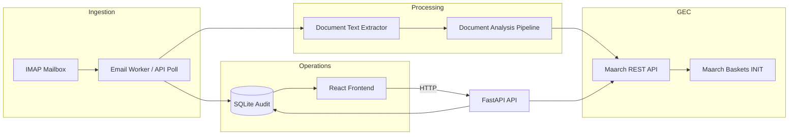
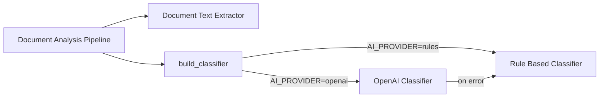

#  Intelligent Mailroom

**AI-powered automated mail dispatching platform integrated with Maarch Courrier.**

Intelligent Mailroom automates the qualification of incoming mail before human workflow
in **Maarch Courrier (GEC)**. It polls an IMAP mailbox, extracts and classifies document
content, and injects structured courriers into Maarch via its REST API — with an optional
human validation step in Maarch baskets.

>  For deep technical details, class-by-class documentation, sequence diagrams, and
> design decisions, see **[ARCHITECTURE.md](./ARCHITECTURE.md)**.

---

##  Features

- **Email Listener** — Polls an IMAP mailbox for unread messages, parses MIME bodies
  and attachments.
- **OCR & Text Extraction** — Extracts text from PDFs (`pypdf`) and optionally from
  images (Tesseract), with graceful fallback to the email body.
- **AI Classification** — Routes each message to the correct destination entity,
  document type, and subject. Ships with a **rule-based classifier** (default) and an
  optional **OpenAI** classifier.
- **Automatic Routing** — Maps inbound mail to Maarch entities and document types
  (e.g. invoice → FIN, HR → DRH, legal → PJU).
- **Maarch Integration** — Fully external service; creates **resources** (courriers),
  uploads attachments, resolves contacts, and manages reference data over the public
  Maarch REST API.
- **Audit Logs** — Append-only SQLite audit trail with **idempotency** via
  `Message-ID`, powering the dashboard and document history.
- **Operations UI** — A React SPA to monitor health, trigger mailbox polls, review
  audit events, explore Maarch metadata, and test the AI classifier.
- **Internationalization** — English and French UI.

---

## High-Level Architecture

```
┌──────────────┐        ┌─────────────────┐        ┌─────────────────────┐
│  IMAP Server │◄──────►│  Intelligent    │──HTTP──►│  Maarch Courrier    │
│  (mailbox)   │  IMAP  │  Mailroom       │ Basic   │  (GEC) REST API     │
└──────────────┘        │  · FastAPI API  │ Auth    └─────────────────────┘
                        │  · Worker       │
                        │  · Frontend     │
                        └────────┬────────┘
                                 │ SQLite
                        ┌────────▼────────┐
                        │   audit.db      │
                        │  (idempotency)  │
                        └─────────────────┘
```

### Ingestion pipeline



### How it works

1. **Poll** an IMAP mailbox for unread messages.
2. **Extract** text from the email body and attachments (PDF / OCR).
3. **Classify & route** to a destination entity, document type, and subject.
4. **Create** a Maarch **resource** (courrier) in status `INIT` (Qualification basket).
5. **Attach** remaining files and record an audit trail.

The service **does not modify Maarch core** — it is a separate FastAPI application that
calls Maarch's documented REST endpoints.

---

## Tech Stack

| Layer                    | Technology                                                       |
| ------------------------ | ---------------------------------------------------------------- |
| **API**                  | FastAPI, Uvicorn, Starlette                                      |
| **Config**               | Pydantic Settings, `.env`                                        |
| **HTTP client (Maarch)** | `requests` + session, Basic Auth, retries                        |
| **Email**                | stdlib `imaplib`, `email`                                        |
| **OCR / PDF**            | `pypdf`; optional `pytesseract` + Pillow                         |
| **AI (optional)**        | OpenAI-compatible Chat Completions API                           |
| **Persistence (audit)**  | SQLite via stdlib                                                |
| **Frontend**             | React 19, Vite, TypeScript, Tailwind v4, TanStack Query, i18next |
| **Containers**           | Docker Compose (api, worker, frontend)                           |

---

## Repository Structure

```
intelligent-mailroom/
├── main.py                 # Uvicorn entry: create_app()
├── Dockerfile              # Backend image
├── docker-compose.yml      # api + worker + frontend
├── requirements.txt        # Python dependencies
├── ARCHITECTURE.md         # Deep technical handbook
├── src/
│   ├── api/                # HTTP layer (routes, dependencies, app factory)
│   ├── ai/                 # Classification pipeline (rules + OpenAI)
│   ├── config/             # Settings singleton (.env)
│   ├── database/           # Audit repository (SQLite)
│   ├── email/              # IMAP client + ingestion orchestrator
│   ├── maarch/             # Maarch REST client & services (facade)
│   ├── ocr/                # Text extraction (PDF / OCR)
│   ├── utils/              # Structured logging
│   └── workers/            # Background polling loop
├── tests/                  # Pytest suite
├── scripts/                # Utility/operational scripts
├── frontend/               # React SPA (thin consumer of the API)
└── MaarchSource/           # Externally bundled Maarch Courrier source
```

### Backend modules

| Module          | Responsibility                                           |
| --------------- | -------------------------------------------------------- |
| `src/api/`      | HTTP layer — routes, CORS, dependency wiring             |
| `src/ai/`       | Routing rules, classifiers, analysis pipeline            |
| `src/config/`   | `Settings` from environment (Pydantic)                   |
| `src/database/` | SQLite audit schema and queries                          |
| `src/email/`    | IMAP client, MIME parsing, ingestion service             |
| `src/maarch/`   | HTTP client, resources, attachments, reference, contacts |
| `src/ocr/`      | PDF / text / image extraction → `OcrResult`              |
| `src/workers/`  | Infinite poll loop with sleep                            |
| `src/utils/`    | Logging helpers                                          |

---

## Prerequisites

- **Python 3.10+**
- **Node.js 20+** (for the frontend)
- A reachable **Maarch Courrier** instance with REST API access
- An **IMAP** mailbox (for email ingestion)
- _(Optional)_ An **OpenAI-compatible** API key for the LLM classifier

---

## Quick Start

### Option A — Local development (backend)

```powershell
# 1. Create a virtual environment
python -m venv .venv
.venv\Scripts\activate

# 2. Install dependencies
pip install -r requirements.txt

# 3. Configure environment (copy to .env and fill in values)
copy .env.example .env

# 4. Run the API
uvicorn main:app --reload
```

The API is served at `http://localhost:8000` with interactive docs at
`http://localhost:8000/docs`.

### Option B — Local development (frontend)

```powershell
cd frontend
npm install
npm run dev
```

Open `http://localhost:5173`. The Vite dev server proxies `/api` to
`http://localhost:8000`.

### Option C — Docker Compose (recommended)

```powershell
# 1. Configure environment variables
copy .env.example .env

# 2. Build and start all services
docker compose up --build
```

| Service    | Container                     | Port    |
| ---------- | ----------------------------- | ------- |
| `api`      | intelligent-mailroom-api      | `:8000` |
| `worker`   | intelligent-mailroom-worker   | —       |
| `frontend` | intelligent-mailroom-frontend | `:5173` |

> In Docker, `MAARCH_URL` defaults to `http://host.docker.internal:8081` so containers
> can reach a Maarch instance running on the host. Worker and API share the audit DB on
> a named volume to preserve idempotency across processes.

---

## Configuration

All settings are loaded from environment variables via a `.env` file (see
[`src/config/settings.py`](./src/config/settings.py)).

| Variable                              | Default                            | Purpose                       |
| ------------------------------------- | ---------------------------------- | ----------------------------- |
| `APP_NAME`                            | `Intelligent Mailroom`             | API title                     |
| `APP_ENV`                             | `development`                      | Environment label             |
| `LOG_LEVEL`                           | `INFO`                             | Logging level                 |
| `MAARCH_URL`                          | _(required)_                       | Maarch base URL               |
| `MAARCH_USERNAME` / `MAARCH_PASSWORD` | —                                  | Maarch Basic Auth credentials |
| `MAARCH_TIMEOUT`                      | `30`                               | HTTP timeout (seconds)        |
| `MAARCH_DEFAULT_MODEL_ID`             | `8`                                | Default indexing model        |
| `MAARCH_DEFAULT_STATUS`               | `INIT`                             | Initial workflow status       |
| `MAARCH_DEFAULT_ATTACHMENT_TYPE`      | `incoming_mail_attachment`         | Attachment type key           |
| `MAARCH_RETRY_COUNT`                  | `3`                                | Client retry count            |
| `MAARCH_RETRY_BACKOFF_SECONDS`        | `1.0`                              | Exponential backoff base      |
| `MAARCH_AUTO_CREATE_CONTACTS`         | `true`                             | POST contacts for senders     |
| `EMAIL_HOST` / `EMAIL_PORT`           | — / `993`                          | IMAP connection               |
| `EMAIL_USERNAME` / `EMAIL_PASSWORD`   | —                                  | IMAP credentials              |
| `EMAIL_USE_SSL`                       | `true`                             | Use SSL for IMAP              |
| `EMAIL_MAILBOX`                       | `INBOX`                            | Mailbox to poll               |
| `EMAIL_FETCH_LIMIT`                   | `20`                               | Max messages per poll         |
| `EMAIL_MARK_AS_READ`                  | `true`                             | Mark `\Seen` after ingestion  |
| `EMAIL_DEFAULT_DESTINATION`           | `13`                               | Fallback entity serialId      |
| `EMAIL_POLL_INTERVAL_SECONDS`         | `60`                               | Worker sleep interval         |
| `OCR_ENABLED`                         | `true`                             | Master OCR switch             |
| `OCR_TESSERACT_ENABLED`               | `false`                            | Image OCR (Tesseract)         |
| `OCR_TESSERACT_LANG`                  | `fra+eng`                          | Tesseract languages           |
| `AI_ENABLED`                          | `true`                             | Skip analysis when `false`    |
| `AI_PROVIDER`                         | `rules`                            | `rules` or `openai`           |
| `OPENAI_API_KEY` / `OPENAI_MODEL`     | — / `gpt-4o-mini`                  | Optional LLM                  |
| `OPENAI_BASE_URL` / `OPENAI_TIMEOUT`  | — / `60`                           | LLM endpoint / timeout        |
| `CLASSIFICATION_MIN_CONFIDENCE`       | `0.5`                              | Pipeline confidence floor     |
| `AUDIT_ENABLED`                       | `true`                             | SQLite logging                |
| `AUDIT_DB_PATH`                       | `data/audit.db`                    | DB file path                  |
| `MAARCH_DOCKER_URL`                   | `http://host.docker.internal:8081` | Compose override              |

**Note:** A missing `MAARCH_URL` fails settings load; missing Maarch credentials raise a
`MaarchConfigurationError` when the client is constructed. Use TLS in production.

---

## API Reference

Everything is mounted under the `/api/v1` prefix.

| Method | Path                              | Purpose                         |
| ------ | --------------------------------- | ------------------------------- |
| GET    | `/api/v1/health`                  | Basic health                    |
| GET    | `/api/v1/health/live`             | Liveness probe                  |
| GET    | `/api/v1/health/ready`            | Dependency readiness            |
| GET    | `/api/v1/email/status`            | IMAP configuration summary      |
| GET    | `/api/v1/email/health`            | IMAP ping                       |
| POST   | `/api/v1/email/poll`              | Trigger mailbox ingestion       |
| GET    | `/api/v1/analysis/status`         | AI / OCR configuration          |
| POST   | `/api/v1/analysis/classify`       | Classify text (no Maarch write) |
| GET    | `/api/v1/analysis/routing-rules`  | Static routing rules            |
| GET    | `/api/v1/maarch/connection`       | Validate Maarch connection      |
| GET    | `/api/v1/maarch/health`           | Maarch ping                     |
| GET    | `/api/v1/maarch/entities`         | Entity list                     |
| GET    | `/api/v1/maarch/reference`        | Models, statuses, defaults      |
| POST   | `/api/v1/maarch/resources`        | Create a courrier               |
| POST   | `/api/v1/maarch/resources/search` | Search resources                |
| POST   | `/api/v1/maarch/attachments`      | Add an attachment               |
| GET    | `/api/v1/audit/events`            | Audit trail                     |

---

## Frontend Pages

| Route         | Backend APIs used                                 |
| ------------- | ------------------------------------------------- |
| `/` Dashboard | health, email, maarch, analysis, audit, poll      |
| `/email`      | email, audit, poll                                |
| `/ai`         | analysis status / routing-rules / classify        |
| `/documents`  | audit events (`event_type=ingested`)              |
| `/maarch`     | maarch connection / health / entities / reference |
| `/settings`   | read-only status endpoints                        |
| `/logs`       | audit events                                      |

The frontend is a **thin client** — it reflects backend state and triggers existing
endpoints, without duplicating ingestion logic.

---

## AI & Routing

### Classification pipeline



### Default routing rules

| Category    | Entity | Example keywords       | Default doctype |
| ----------- | ------ | ---------------------- | --------------- |
| `invoice`   | FIN    | facture, invoice, tva  | 407             |
| `hr`        | DRH    | rh, congé, recrutement | 703             |
| `legal`     | PJU    | juridique, contentieux | 503             |
| `it`        | DSI    | informatique, cyber    | 911             |
| `technical` | PTE    | voirie, travaux        | 1202            |
| `social`    | PSO    | social, rsa            | 801             |
| `general`   | COU    | (fallback)             | 1203            |

### Fallback behavior

| Condition            | Fallback                            |
| -------------------- | ----------------------------------- |
| No OpenAI key        | Rule-based classifier               |
| LLM error            | Rule-based classifier               |
| Low confidence       | Safe destination / doctype defaults |
| No reference service | Statically defined doctype IDs      |

---

## Testing

```powershell
# Run the full test suite
pytest
```

| Test file                            | Focus                                       |
| ------------------------------------ | ------------------------------------------- |
| `tests/test_maarch.py`               | Client errors, serialization, health routes |
| `tests/test_email.py`                | IMAP / processor mocks                      |
| `tests/test_ai.py`                   | Rule classifier routing                     |
| `tests/test_email_classification.py` | Ingestion + classification integration      |
| `tests/test_phase5.py`               | Audit, retries, contacts                    |
| `tests/test_health.py`               | Readiness probes                            |
| `tests/test_config.py`               | Settings                                    |

---

## Documentation

- **[ARCHITECTURE.md](./ARCHITECTURE.md)** — the full technical handbook covering
  class-by-class documentation, execution flows, sequence diagrams, design patterns,
  security considerations, and extension guides.
- **[frontend/README.md](./frontend/README.md)** — frontend-specific setup and details.

---

## Contributing

1. Fork the repository and create a feature branch.
2. Run the existing test suite to ensure a clean baseline.
3. Add tests for any new behavior.
4. Submit a pull request describing the change.

## License

See the project's license files (e.g. `MaarchSource/LICENSE.txt` for the bundled
Maarch Courrier source) for applicable licensing terms.
